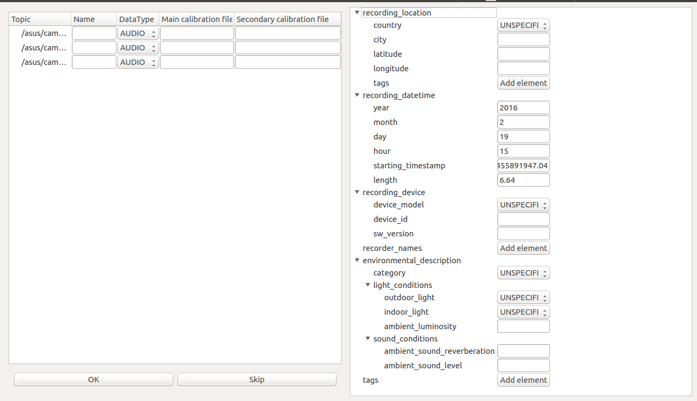
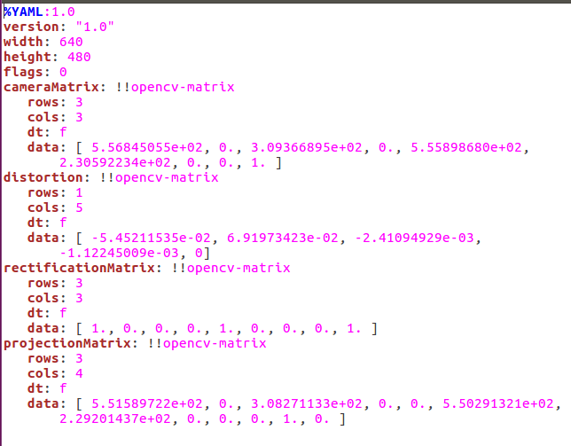
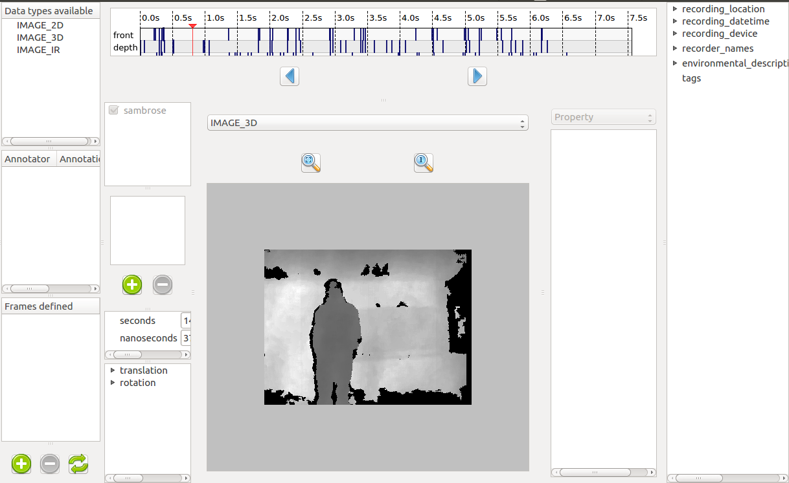

.. warning::
	This section describes features that have been made specifically for
	Aldebaran's needs. They might not all be fully usable for more general
	purposes, even though they aim to be, in the future.

Create a dataset from a ROSbag
------------------------------

Previously, we saw how to create a dataset from a folder, using the graphical
interface. However, there is another option, which is to extract data from a
ROSbag file.

If you have no idea what a ROSbag is, then you can probably skip this section. 
Just know that ROSbags are a sort of archive files in which data is organized in
different structures and dated. 

If you are interested, you can have a look here. After that, I will assume you
are familiar with ROS and its vocabulary.

http://wiki.ros.org/

http://wiki.ros.org/rosbag

To create a QiDataSet from a ROSbag, you need to have a ROS workspace sourced to
begin with. Then you can run::

	qidata extract <path/to/bag>

.. warning::
	For now, the bag MUST have a /tf topic to be extracted. /tf is not shown in
	the topic list, but it is always used to compute the sensor position when
	the camera

.. warning::
	Only bags recorded from an SBRE robot with `naoqi_driver <https://github.com/ros-naoqi/naoqi_driver>`_ can actually be extracted. 

You should then see something like this:

The right-panel should remind you something. It is the future context of the
dataset. Thanks to the information already contained by the ROSbag, the
timestamp-related information are already filled when the bag is opened. The
rest is up to you!

On the left panel, you can select which topic you want to record. To extract
data from a topic, you need to give it a name in the second column. An empty
space means the topic will not be extracted. 

You can then select the type of data it is (very useful to specify if the images
are 2D, 3D, or stereo). Finally, the last two columns are here to specify a
calibration file if the selected data is an image (if not, it is ignored). The
second file is only used if the type is "IMAGE_STEREO". 

The file used for calibration must have a certain format. Once again, this is
due to the way Nao and Pepper store their camera calibrations.

Streams and frames
------------------

The point of a dataset is to be used as an input for an algorithm. Depending on
the algorithm and the way it works, the dataset will be different. We can
separate the different types of datasets along two axis:

* Mono-modal VS multi-modal
* Unrelated frames VS Data streams

The first category is only a question of how many different data types the
dataset offers. The second, however, is about the dependency of the different
items towards time.

This topic will be more explained in the following pages of the documentation,
but for now, it can be summarized like this:

+-------------+--------------------------------------+----------------------+
|             | Unrelated frames                     | Data streams         |
+=============+======================================+======================+
| Mono-modal  | Single type of files                 | One data stream      |
+-------------+--------------------------------------+----------------------+
| Multi-modal | Several type of files + QiDataFrames | Several data streams |
+-------------+--------------------------------------+----------------------+

A "frame" describes a list of files that must be given together to a relevant
algorithm. 
A "stream" is a mapping between a timestamp and a file and describe when a
specific file must be given to an algorithm. 

.. note::

	Be aware that frames and streams are totally different. Frames gather files
	of different type, whereas streams gather files of the same type but with
	different datetime of occurence. However, as it is possible to obtain frames
	from the definition of several streams, it is never possible to define
	frames if streams are defined.

Defining frames
+++++++++++++++

So you might be wondering how to define frames. Well that's simple. You can
create a frame by opening a dataset and then clicking the "+" button (number 4
on the image in the previous page). You will then be able to select several
files that will become the components of your frame, which will appear in the
frame section. That's it

Defining streams
++++++++++++++++

And to define streams ? Well, you can't. Streams represent flows of data, such
flows that usually come from a recording device. As a result, it seems useless
for a human to be able to define manually some data streams. Those streams
should be defined solely by the recording program. 

For instance, streams are created out of ROS topics when creating a QiDataSet
out of a ROSbag. 

Visualizing streams
+++++++++++++++++++

When frames are defined, they can be seen in the "Frames defined" area. What
about streams ? 

Well if streams are defined, the window is actually a little bit different. A
new widget can be seen that shows on a timeline *when* your files are located.
You can then click anywhere, and the most recent file will be opened for you
to annotate it.

