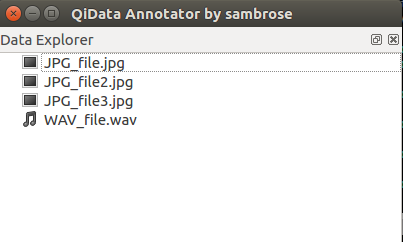
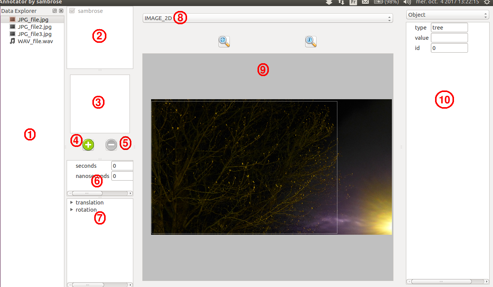
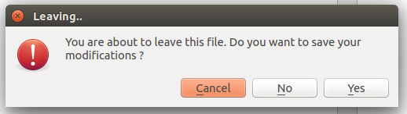
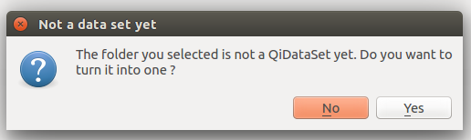
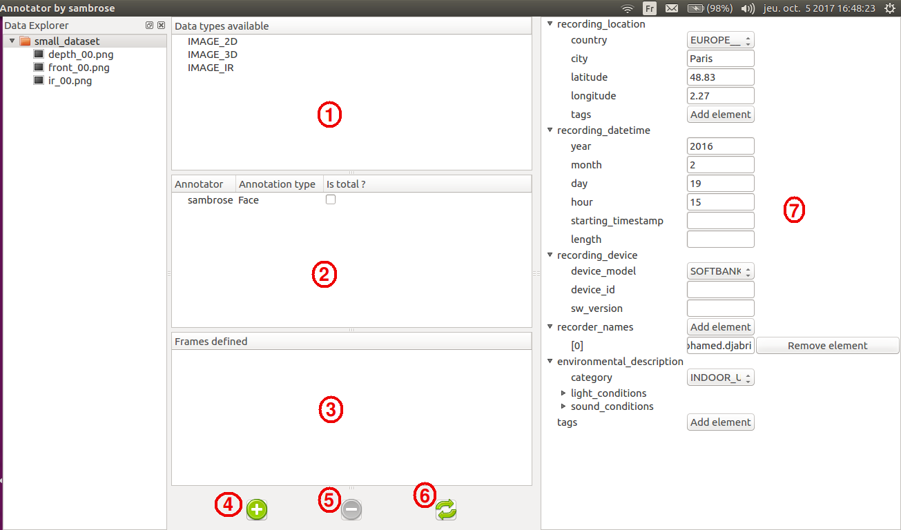

Basic usage
===========

Start the annotation tool
-------------------------

To start the annotation tool, run the following command::

	$ qidata annotate <userID> <path>

``userID`` must be something that can be easilly traced back to you, like your
gmail account name, or your employee number in your company. This information is
used to "sign" your annotations and keep track of who annotates what.

``path`` is the folder containing the data you want to annotate. No argument
will default to your current location.

.. warning::

	Note that <path> MUST be a folder. If you only want to annotate a single
	file, you might use this command instead::

	$ qidata open -w <userID> <filepath>

You should now be able to see a window displaying a file tree.

You can select any file in the tree, as only supported files are displayed.
On the day I write this documentation, only images are really well supported.
WAV files support is still in alpha and does not have many specific features yet,
so it won't be mentioned for now. Now, pick up a file, and let's go !

Add annotations on a file
-------------------------

When annotating a file, the interface will look like this:

There are several areas:

1) File selection area
    This box is absent if you used ``qidata open`` command. You can use it to
    switch from one file to another.
2) Annotator selection area
    This area allows you to select whose annotations you want to see. Your own
    name is always ticked and cannot be unticked. But if this file was also
    annotated by other people, you can choose to hide/show their contribution
3) Global annotations area
    This part shows the list of annotations that are "global". You'll find more
    details about "global" annotations below
4) Add a global annotation
    This button creates a new global annotation
5) Remove a global annotation
    This button removes the selected global annotation
6) Timestamp area
    This area shows the timestamp of the image if it was available. Otherwise,
    (0,0) is displayed
7) Transform area
    This area represents the position of the camera in a global frame. This can
    be useful if you want to specify the position of your camera in a specific
    frame. This is particularly handy if you want to use multi-modal data (but
    we'll come back on that later)
8) Data type selector
    For now, the program only knows that this is an image, but not if this image
    represents an RGB image or a depth map. Use this selector to specify what
    your image is.
9) Localized annotations area
    This area displays your data as well as annotations localized on it. We'll
    talk more about this area below.
10) Annotation's details area
    This area allows you to specify the type of your annotation and to modify
    the values of its fields.

Global vs localized annotations
+++++++++++++++++++++++++++++++

When annotating a file, some annotations may concern the whole file, whereas
some others might concern only a specific area. For instance, you might want to
tag a face in the middle of your image (so a specific area) or you also might
simply want to annotate the fact that this image contains a face without
specifying its location (so it concerns the whole file). The first annotation
is localized, while the latter is global.

Handling localized annotations
++++++++++++++++++++++++++++++

The area marked "9" is here to handle localized metadata. Several actions are
possible:

- Add an annotation

	Click anywhere where there isn't an annotation already. This will add a new
	red square, representing an annotation

- Select an annotation

	Click on an existing annotation to select it. The square becomes white and
	the annotation details are displayed in the area "10".

- Move a selected annotation

	Once selected, an annotation can be moved. Press the left mouse button while
	on the annotation and keep it pressed while moving to your destination. Then,
	release the mouse button.

- Change the selected annotation's size

	There are two ways to change the annotation size. You can either scroll
	(scrolling up increases the size vertically and horizontally, scrolling down
	reduces it) or use the arrows (up/down to increase/decrease vertical size,
	left/right to increase/decrease horizontal size)

- Remove the selected annotation

	Once selected, an annotation can be removed by right-clicking on it.

Edit an annotation's details
----------------------------

Now you now how to add, position and remove an annotation, let's see how to edit
the information about it. On the area "10" is displayed the information about
the selected annotation. You can first use the box to select the type of
annotation you want.

.. warning::
	When you change the message type, the entered information are lost, so don't
	change the type before saving your inputs or without being sure that that's
	what you want to do.

Then, you can simply fill the fields. It is important to fill as many
information as possible, as they might be used later for testing. But if you
don't know, it's ok. Don't invent ^_^.

Save your modifications
-----------------------

For now, there is no "Ctrl+S" behavior nor any way to save manually. The only
way is to close your file. You will then be asked if you want to save your
changes or if you want to cancel the file closing.

Add some context, use a dataset
-------------------------------

Create a dataset
++++++++++++++++

Opening files and adding annotations is good. But what's even better is to
gather all of these files in a folder that will be turned into a dataset to
add extra information about the files it contains. Click on a folder containing
annotated files. If it is not already a dataset, you will be asked if you want
to turn it into one. Say "Yes".

Use a dataset
+++++++++++++

You should then see something like this:

Let's examine those new areas:

1) Available datatypes:
    This box displays the list of datatypes available in the dataset. There is
    nothing to do here.
2) Available annotations:
    This area is special. It shows the annotations found in the dataset, but you
    should notice a pretty strange "Is total ?" check box beside each annotation
    type. This check box is here to give you the opportunity to guarantee that
    this annotation is complete.

    .. note::

        "Complete" means all files of the dataset were annotated. You might
        wonder how this is useful.
        Imagine a file in the dataset has no "Face" annotation. Does it mean
        that there is no face visible in the file, or that the annotator forgot
        to annotate that specific file ? When the annotation is registered as
        "TOTAL", it means that every file without a "Face" annotation has
        actually no face in it. This information can be used by testing programs
        to decide if false positives can be measured or not.

        :Example:

		For a test, I use a data set where "jdoe" annotated Faces. But he said
		he did not have time to finish it all, and that he might have forgotten
		some images. During your test, if you encounter a file without any
		annotation, does it mean that there is no face in it, or is it a file
		forgotten by the annotator ?

		Tough question, right ? It is actually impossible to guess without
		looking at the picture. But at least, you KNOW that the annotator has
		forgotten some files, so you are prepared to take that in account in
		your results. What if he didn't tell you ? For instance because he does
		not know you ?

		That is what the *total annotation* is about. Once an annotator has
		finished to annotate something on a data set, he or she can state that
		the annotation is *total*, guaranteeing that no file has been forgotten.
		And on the other hand, using a non-total annotation means you need to be
		aware that some files might not be annotated.

3) Frames area
    This part shows the list of defined frames. You'll find more details about
    frames in the following sections
4) Add a frame button
    This button opens a pop-up to help you create a new frame
5) Remove a frame button
    This button removes the selected frame
6) Refresh button
    This button refreshes the information about the dataset content (available
    types available annotations, defined frames)
7) Context area
    This area displays contextual information about the dataset. See below.

Context
+++++++

Context is here to describe the when, the where, the who, the what and the how
of a dataset. Its most powerful interest is when a data set contains related
data (like images extracted from a video), in which case "context" will contain
information about where the original video was taken, by which camera, by who,
in which circumstances, and so on..

When data files are not related, it can still have some interest if they have
a common treat (all coming from the same device for instance, or taken at the
same place).

Ideally, context should be filled by the program creating the dataset in the
first place. But as they don't exist yet, we rely on you :)

There are MANY fields in the Context message, and not all of them are easy to
understand. You will be able to find more details about what each fields mean
here: :ref:`context-doc`.

Good practices
--------------

What are the steps to follow for a good annotation ? Here they are:

1. When creating a localized annotation, localize it depending on your feeling
   That's what creates the importance of having several annotators. Everyone
   will not square a face using the same limits, and that's what's interesting.

2. The more you annotate, the better. Why not annotate Persons along with Faces?
   However, we know annotation can be long and boring, so make sure you don't
   annotate more that you can stand. Sticking to fewer annotation types and
   doing it right is better than starting to annotate everything and then giving
   up.

3. Do not forget to turn the containing folder into a QiDataset and, if it makes
   sense, fill the context. Then, if you know for sure you did not forget any
   file, state that your annotations are "total"

Tips, advices and remarks
-------------------------

Copy/Paste behavior
+++++++++++++++++++

When a file is opened, you can copy the annotations displayed and paste them on
the next file you open (or in the current one).

.. warning::
	This will copy ALL displayed annotations. For now, there is no way to copy
	only one annotation

Limitations and future improvements
-----------------------------------

* For now, it is not possible to have nested data sets. As a result, you must
  avoid having folders inside a data set, at least for the moment. This should
  be available pretty soon, so please avoid doing so in the mean time.

* Localized annotation can only be marked with rectangles. We did not plan to
  improve this, so if you really need something more powerful please raise a
  feature request explaining for what case you need it.

Report an issue or a feature request
------------------------------------

If you find an issue, or would like to add a feature, please report it here:
	https://github.com/aldebaran/qidata_gui/issues

using either "bug" or "feature" label.